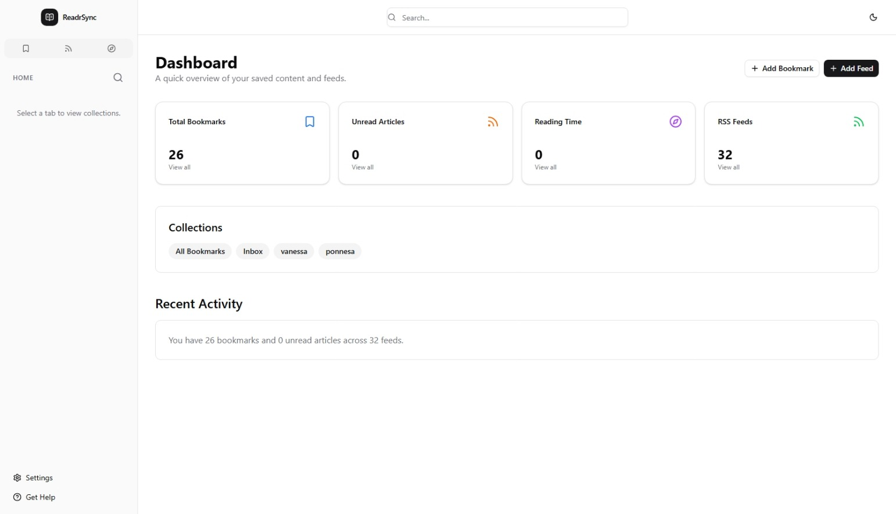
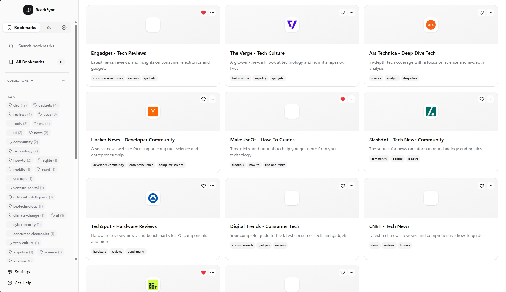
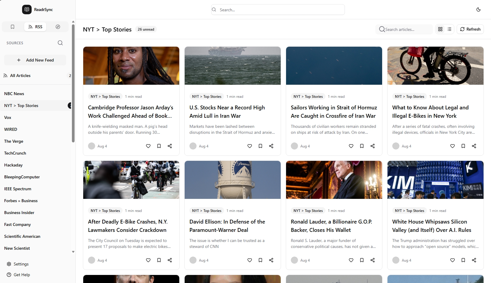
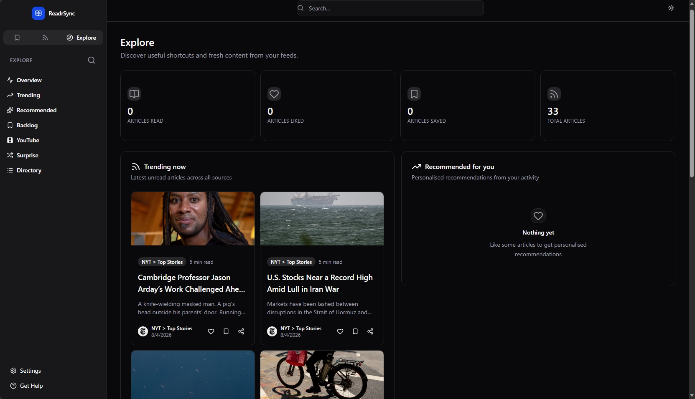

<div align="center">

<!--  -->

# ReadrSync

### Your bookmarks and feeds, everywhere you read.

**One place for the links you save and the feeds you follow, synced across desktop, web, and mobile.**


[Download](#-download) · [Features](#-why-youll-love-it) · [Screenshots](#-see-it-in-action) · [Demo Video](#-watch-the-demo) · [Get Started](#-get-started-in-minutes)

<br/>



</div>

<br/>


**ReadrSync brings all your links into one calm, distraction-free space.** Save a link, subscribe to a feed, and read it later, on your laptop, in your browser, or from your phone on the train. No accounts to manage, no cloud lock-in, no ads. Just your reading list, exactly how you left it.

> 🔒 **Local-first by design.** Your data lives on your device, not on someone else's server.

<br/>

## 📸 See It in Action

<div align="center">


<p><em>Organize every bookmark with tags, descriptions, and auto-fetched favicons.</em></p>

<br/>


<p><em>A clean, distraction-free reading view for all your favorite feeds.</em></p>

<br/>


<p><em>Easy on the eyes, day or night, with built-in dark mode.</em></p>

</div>


<br/>

<!-- ## Demo

 <div align="center">

[](https://your-video-link-here)

*Click to watch a 90-second tour of ReadrSync in action.*

</div> -->


<br/>

## 💡 Features


- 📚 **Effortless Bookmarking** 

- 📰 **Feeds, Simplified** 

- 🎨 **Gorgeous on Every Screen** 

- 💾 **Your Data, Your Device** 

- 🌙 **Easy on the Eyes** 

- 🔍 **Find Anything Fast** 

- ✍️ **Highlight & Annotate** 


<br/>

## 🖥️ One App, Every Platform

<div align="center">

</div>

- 🖥️ **Desktop**, a fast, native app powered by Tauri
- 📱 **Mobile**, a native-feeling companion built with Expo and React Native

<br/>

## 🚀 Development

```bash
# 1. Clone the repository
git clone https://github.com/Abdulkareemoj/ReadrSync.git
cd ReadrSync

# 2. Install dependencies
pnpm install

# 3. Launch your platform of choice
cd apps/web && pnpm dev        # Web → http://localhost:5173
cd apps/desktop && pnpm tauri dev   # Desktop app
cd apps/mobile && pnpm dev     # Mobile via Expo Go
```

**Prerequisites:** Node.js 18+, pnpm 8+, and Rust/Cargo (desktop) or the Expo CLI (mobile).

<br/>

## 📥 Download

<div align="center">

| Platform | Status |
|---|---|
| 🖥️ Desktop (Tauri) | Build from source, see [Get Started](#-get-started-in-minutes) |
| 🌐 Web | Run locally, hosted version coming soon |
| 📱 iOS / Android | Available via Expo Go during development |

*Official builds and app-store links will be added here as releases ship.*

</div>

<br/>
<!-- 
## 🗺️ What's Next

ReadrSync is actively growing. Here's what's already here and what's coming:

**Available now**
- ✅ Rich bookmark management with tags and metadata
- ✅ Offline-ready RSS reader
- ✅ Consistent cross-platform design
- ✅ Local-first, private-by-default storage

**On the roadmap**
- [x] Optional cloud sync across devices
- [ ] Browser extension for one-click saving
- [x] Full-text search
- [ ] Push notifications for new articles
<!-- - [ ] AI-powered summaries -->
- [x] Import/export via OPML and HTML
- [x] Collections sorting -->

Have a feature request? [Open an issue](https://github.com/Abdulkareemoj/ReadrSync/issues), we're building this in the open.

<br/>

## 🧰 Under the Hood

<details>
<summary>For the developers curious about the stack (click to expand)</summary>

<br/>

**Web & Desktop:** React 19, TailwindCSS 4, shadcn/ui, Tanstack Start / React Router, Zustand + Jotai, SQLite via Drizzle ORM, Vite + Tauri

**Mobile:** Expo + React Native, UniWind styling, Zustand, Expo SQLite / AsyncStorage, Expo Router

**Shared Core:** BookmarkAgent, RssAgent, and HighlightAgent power platform-agnostic data operations; Turborepo ties the monorepo together

**Tooling:** TypeScript, Biome, pnpm, Vitest + Testing Library

```bash
pnpm check-types   # Type checking
pnpm lint          # Lint
pnpm format        # Format
pnpm test          # Tests
pnpm check         # Run everything
```

</details>

<br/>

## 🤝 Contributing

1. Fork the repo and create a branch: `feature/your-idea`
2. Make your changes and add tests
3. Update docs where it makes sense
4. Verify it works across platforms
5. Open a pull request 🎉

<br/>

## 📄 License

Released under the [MIT License](LICENSE), free to use, modify, and share.

<br/>

<div align="center">


[Website](#) · [Twitter/X](#) · [Discord](#) · [Issues](https://github.com/Abdulkareemoj/ReadrSync/issues)

*Enjoying ReadrSync? Consider giving the repo a ⭐.*

</div>
